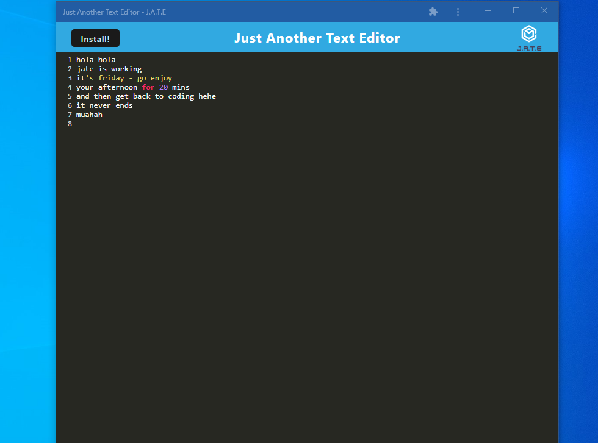

# Progressive Web Applications (PWA): Just Another Text Editor

## Description

This is an on/off-line text editor that runs in the browser as a single-page application meeting the PWA criteria. The coolest part about this project is text editor is that it also functions offline, so even when you are having connectivity issues, you can still use this application. Users can additionally istall the application in their local computers, and run it as a desktop app.

## Table of Contents

- [Installation](#installation)

- [Link](#link)

- [Application Appearance](#appearance)

- [Contact](#contact)

## Installation

To install all dependencies, run `npm i` in your command line.

To install the application in your desktop, click the Install button in the upper left hand corner and you are ready to use this app on your computer.

## Appearance

## Link

To access the deployed application through Heroku, visit the following link: https://rocky-mesa-13439.herokuapp.com/

## Contact

Hiya! If you want to connect or have any questions about this repository, please contact me directly at catacueto@gmail.com. You can find more of my work at https://github.com/catcueto.
